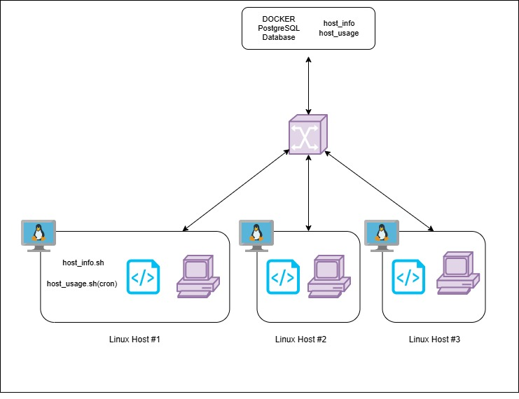

# Linux Cluster Monitoring Agent

## Introduction
This project implements a  that collects and stores hardware specifications and real-time resource usage data from multiple Linux servers into a centralized **PostgreSQL** database.

The **Linux Cluster Monitoring Agent** is a monitoring solution designed to collect and centralize hardware specifications and real-time resource usage data from multiple Linux servers. The system is desinged to meet the requirements of the Jarvis LCA(Linux Cluster Administration) team, who maintain clusters of Rocky Linux nodes connected through an internal network.

The tool allows system administrators and DevOps teams to monitor CPU, memory, and disk usage across servers in a distributed environment.

The system is automated and scalable:

- Hardware data collected **once per host**
- Usage metrics collected **every minute via crontab**
- Technologies: **Bash, PostgreSQL, Docker, Linux, Git**

## Quick Start

### 1 Start a PostgreSQL instance using Docker
```bash
bash scripts/psql_docker.sh create postgres password
bash scripts/psql_docker.sh start
```

### 2 Create the database and tables
```bash
psql -h localhost -U postgres -W
CREATE DATABASE host_agent;

psql -h localhost -p 5432 -U postgres -d host_agent -f sql/ddl.sql
```

### 3 Insert host hardware specification (run once)
```bash
bash scripts/host_info.sh localhost 5432 host_agent postgres rocky1234
```

### 4 Insert real-time host usage data
```bash
bash scripts/host_usage.sh localhost 5432 host_agent postgres rocky1234
```

### 5 Automate usage collection every minute (crontab)
```bash
* * * * * bash /home/rocky/dev/jarvis_data_eng_AramKhanlari/linux_sql/scripts/host_usage.sh localhost 5432 host_agent postgres password > /tmp/host_usage.log 2>&1
```

##  Implementation
The monitoring solution consists of:

- **Multiple Linux hosts**
- **One PostgreSQL database** (Docker container)
- **Two Bash scripts per host**
    - `host_info.sh` collects static hardware info
    - `host_usage.sh` collects CPU & memory usage
- All data is inserted into the centralized DB for reporting & analytics.

##  Architecture
The architecture includes:

- Linux hosts running monitoring agents
- A single PostgreSQL Docker container
- Cron-based automated execution every minute
  
##  Scripts

### `psql_docker.sh`
This script is responsible for creating, starting and stopping containers. 
```bash
bash scripts/psql_docker.sh create postgres password
bash scripts/psql_docker.sh start
bash scripts/psql_docker.sh stop
```

### `host_info.sh`
This script fills in information regarding the host into the database. It has the columns listed in host_info Table. 
```bash
bash scripts/host_info.sh localhost 5432 host_agent postgres password
```

### `host_usage.sh`
This script fills in information regarding the usage into the database. It has the columns listed in host_usage Table.
```bash
bash scripts/host_usage.sh localhost 5432 host_agent postgres password
```

### Crontab example
This makes sure requests are submitted every minute and the data is updated accordingly.
```bash
* * * * * bash /home/rocky/dev/jarvis_data_eng_AramKhanlari/linux_sql/scripts/host_usage.sh localhost 5432 host_agent postgres password > /tmp/host_usage.log 2>&1
```

## Database Modeling

### **host_info Table**
| Column Name      | Data Type   | Description            |
|------------------|-------------|------------------------|
| id               | SERIAL (PK) | Unique host identifier |
| hostname         | VARCHAR     | Hostname               |
| cpu_number       | INT2        | Number of CPU cores    |
| cpu_architecture | VARCHAR     | CPU architecture       |
| cpu_model        | VARCHAR     | CPU model              |
| cpu_mhz          | FLOAT8      | CPU mHz                |
| l2_cache         | INT4        | L2 cache               |
| total_mem        | INT4        | Total memory (MB)      |
| timestamp        | TIMESTAMP   | Record timestamp       |

### **host_usage Table**
| Column Name     | Data Type   | Description                    |
|-----------------|-------------|--------------------------------|
| timestamp       | TIMESTAMP   | Time of record collection      |
| host_id         | SERIAL (FK) | Links to host_info             |
| memory_free     | INT4        | Free memory (MB)               |
| cpu_idle        | INT2        | CPU idle percentage            |
| cpu_kernel      | INT2        | CPU kernel percentage          |
| disk_io         | INT4        | Disk I/O usage                 |
| disk_available  | INT4        | Free disk space (MB)           |

## Testing

### Check database container
```bash
docker ps
```

### Verify tables
```bash
psql -h localhost -U postgres -d host_agent -c "\\l"
```

### Verify inserted data
```bash
psql -h localhost -U postgres -d host_agent -c "SELECT * FROM host_info;"
```
```bash 
psql -h localhost -U postgres -d host_agent -c "SELECT * FROM host_usage;"
```

## Deployment

### 1. Clone the repository
```bash
git clone https://github.com/jarviscanada/jarvis_data_eng_AramKhanlari.git
cd linux_sql/host_agent/scripts
```

### 2. Start PostgreSQL container
```bash
bash psql_docker.sh create postgres password
```

### 3. Create tables
```bash
psql -h localhost -U postgres -f sql/ddl.sql
```

### 4. Insert host info
```bash
bash host_info.sh localhost 5432 host_agent postgres password
```

### 5. Schedule automated usage collection
```bash
crontab -e
```

## Improvements
- Handle Dynamic Host Updates
- Auto-detect hardware changes and update host_info without manual execution.
- Enhanced Logging & Better Error Handling
- Web monitoring dashboard (with possible alerts for overusage)
